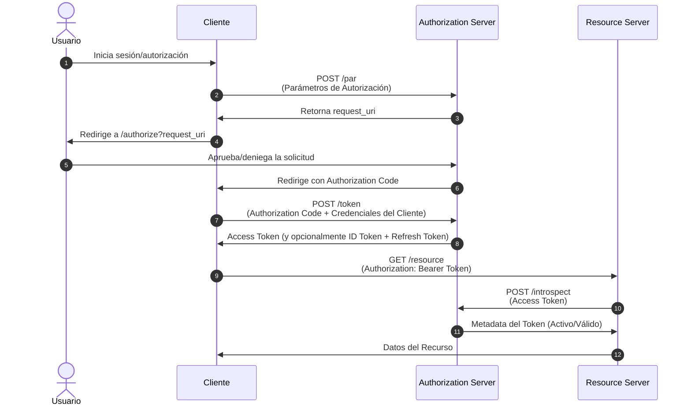

# diagrama-auth-code-grant

```mermaid
sequenceDiagram
    autonumber
    actor User as Usuario
    participant Client as Cliente
    participant AS as Authorization Server
    participant RS as Resource Server

    User->>Client: Inicia sesión/autorización
    Client->>AS: POST /par<br>(Parámetros de Autorización)
    AS->>Client: Retorna request_uri
    Client->>User: Redirige a /authorize?request_uri
    User->>AS: Aprueba/deniega la solicitud
    AS->>Client: Redirige con Authorization Code
    Client->>AS: POST /token<br>(Authorization Code + Credenciales del Cliente)
    AS->>Client: Access Token (y opcionalmente ID Token + Refresh Token)
    Client->>RS: GET /resource<br>(Authorization: Bearer Token)
    RS->>AS: POST /introspect<br>(Access Token)
    AS->>RS: Metadata del Token (Activo/Válido)
    RS->>Client: Datos del Recurso
```
